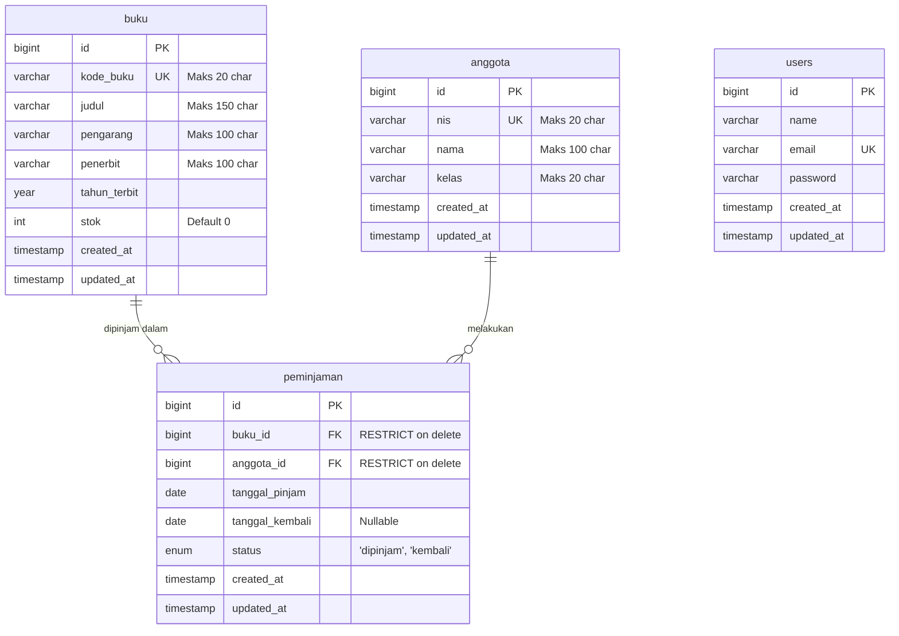

# Sistem Informasi Perpustakaan Sekolah (Laravel + XAMPP MySQL)

Aplikasi web **Sistem Informasi Perpustakaan Sekolah** berbasis **Laravel 12** dan **MySQL (MariaDB XAMPP)** yang dirancang untuk proyek akhir siswa SMK Kelas XII Kompetensi Keahlian Rekayasa Perangkat Lunak (RPL) pada mata pelajaran Pemrograman Web dan Perangkat Bergerak (PWPB).

Kode aplikasi dibangun mengikuti pola standar Laravel (clean architecture, MVC, naming convention) dengan antarmuka dan penanganan validasi sepenuhnya dalam bahasa Indonesia.

---

## 1. Deskripsi Singkat dan Daftar Fitur

Aplikasi ini mengelola operasional sirkulasi peminjaman dan inventaris koleksi buku di perpustakaan sekolah secara efisien, konsisten, dan transparan.

### Daftar Fitur Utama:
1. **Autentikasi Petugas / Admin (Laravel Breeze Blade)**:
   - Login, logout, dan manajemen profil admin yang aman.
   - Proteksi seluruh rute pengelolaan melalui middleware `auth`.
2. **Dashboard Statistik**:
   - Kartu ringkasan jumlah total buku, total anggota siswa, buku yang sedang dipinjam, dan total transaksi peminjaman.
   - Tabel cuplikan 5 aktivitas peminjaman terbaru beserta tombol pengembalian cepat.
3. **Pengelolaan Data Koleksi Buku (CRUD Buku)**:
   - Tambah, lihat, ubah, dan hapus data buku.
   - Pencarian real-time berdasarkan judul, pengarang, atau kode buku (`?cari=`).
   - Paginasi data (10 data per halaman).
   - Validasi kode buku unik dan perlindungan integritas (buku yang memiliki riwayat pinjam tidak dapat dihapus).
4. **Pengelolaan Data Anggota / Siswa (CRUD Anggota)**:
   - Tambah, lihat, ubah, dan hapus data siswa.
   - Validasi NIS (Nomor Induk Siswa) unik.
   - Pencarian berdasarkan nama, NIS, atau kelas.
   - Perlindungan integritas relasi peminjaman.
5. **Transaksi Peminjaman & Pengembalian Buku**:
   - Pencatatan peminjaman dengan pemilihan buku (hanya buku dengan stok > 0 yang muncul).
   - Pengurangan stok buku secara otomatis saat transaksi diproses (`DB::transaction`).
   - Pencegahan peminjaman jika stok habis (stok = 0).
   - Pengembalian buku (`PATCH`) yang otomatis menambah kembali stok buku (+1), mengubah status menjadi `kembali`, dan mencatat tanggal pengembalian.
   - Filter daftar transaksi berdasarkan status (`?status=dipinjam|kembali`).
6. **Laporan Rekapitulasi Buku Sedang Dipinjam**:
   - Menampilkan daftar seluruh buku yang masih berada di tangan siswa.
   - Perhitungan otomatis lama hari peminjaman.
   - Tombol cetak langsung (`window.print()`) dengan template siap cetak dan lembar tanda tangan.

---

## 2. Prasyarat Sistem

Pastikan perangkat Anda memenuhi spesifikasi berikut sebelum menjalankan aplikasi:
- **Sistem Operasi**: Windows 10/11 (atau Linux/macOS)
- **Web Server & Database**: XAMPP (Apache + MySQL / MariaDB versi 10.4+)
- **PHP**: Versi 8.2 atau lebih tinggi (ekstensi aktif: `pdo_mysql`, `mbstring`, `openssl`, `tokenizer`, `xml`, `ctype`, `json`, `fileinfo`)
- **Composer**: Versi 2.x
- **Node.js & NPM**: Node.js v18+ dan NPM v9+

---

## 3. Langkah Instalasi dari Nol

Ikuti urutan langkah instalasi berikut secara bertahap:

### Langkah 1: Siapkan Folder Kerja
Buka terminal (Command Prompt / PowerShell / Terminal VSCode) pada direktori proyek:
```bash
cd "z:\Folder Sekolah\PW\laravelPKL"
```

### Langkah 2: Pasang Dependensi PHP (Composer)
```bash
composer install
```

### Langkah 3: Konfigurasi Environment (`.env`)
Salin file template lingkungan `.env.example` menjadi `.env`:
```bash
copy .env.example .env
```
Pastikan pengaturan koneksi database di file `.env` sebagai berikut:
```env
DB_CONNECTION=mysql
DB_HOST=127.0.0.1
DB_PORT=3306
DB_DATABASE=db_perpus
DB_USERNAME=root
DB_PASSWORD=
```

### Langkah 4: Generate Application Key
```bash
php artisan key:generate
```

### Langkah 5: Buat Database MySQL `db_perpus`
Pastikan modul **MySQL** pada control panel XAMPP sudah berstatus **Running** (hijau). Buat database bernama `db_perpus` via phpMyAdmin (`http://localhost/phpmyadmin`) atau jalankan perintah SQL:
```sql
CREATE DATABASE IF NOT EXISTS db_perpus CHARACTER SET utf8mb4 COLLATE utf8mb4_unicode_ci;
```

### Langkah 6: Jalankan Migrasi dan Seeder
Eksekusi migrasi tabel dan pengisian data awal otomatis:
```bash
php artisan migrate --seed
```

### Langkah 7: Pasang & Kompilasi Aset Frontend (NPM)
```bash
npm install
npm run build
```

### Langkah 8: Jalankan Server Lokal
```bash
php artisan serve
```
Buka browser dan akses aplikasi melalui URL: **`http://127.0.0.1:8000`**

---

## 4. Akun Login Petugas (Demo Latihan)

Untuk masuk ke aplikasi, gunakan kredensial akun bawaan seeder berikut:
- **URL Login**: `http://127.0.0.1:8000/login`
- **Email**: `admin@perpus.test`
- **Password**: `password123`

> **Catatan Keamanan**: Akun di atas dibuat khusus untuk keperluan demonstrasi dan latihan pembelajaran di lingkungan pengembangan lokal (localhost).

---

## 5. Struktur Folder Penting dan Alur MVC

Aplikasi ini menggunakan pola arsitektur **Model-View-Controller (MVC)** standar Laravel:

```
laravelPKL/
├── app/
│   ├── Http/
│   │   └── Controllers/
│   │       ├── AnggotaController.php    # Logika CRUD data siswa
│   │       ├── BukuController.php       # Logika CRUD & stok buku
│   │       ├── DashboardController.php  # Ringkasan data & statistik
│   │       ├── LaporanController.php    # Laporan cetak buku dipinjam
│   │       └── PeminjamanController.php # Transaksi pinjam & kembali (DB Transaction)
│   └── Models/
│       ├── Anggota.php                  # Model tabel 'anggota'
│       ├── Buku.php                     # Model tabel 'buku'
│       ├── Peminjaman.php               # Model tabel 'peminjaman'
│       └── User.php                     # Model tabel 'users' (Admin)
├── database/
│   ├── migrations/                      # Skema pembentukan tabel database
│   └── seeders/
│       └── DatabaseSeeder.php           # Data contoh realistis
├── resources/
│   └── views/                           # Tampilan antarmuka Blade
│       ├── anggota/                     # View index, create, edit anggota
│       ├── buku/                        # View index, create, edit buku
│       ├── layouts/                     # Layout utama (app.blade.php & navigation)
│       ├── laporan/                     # View cetak buku dipinjam
│       ├── peminjaman/                  # View transaksi peminjaman
│       └── dashboard.blade.php          # View dashboard admin
├── routes/
│   ├── auth.php                         # Rute autentikasi Breeze
│   └── web.php                          # Rute utama aplikasi
├── .env.example                         # Contoh konfigurasi database mysql
└── phpunit.xml                          # Konfigurasi pengujian otomatis
```

### Diagram Alur MVC:
```
[ Browser / Pengguna ]
        │  (HTTP Request: misal GET /buku)
        ▼
[ routes/web.php ]  ──(Middleware: auth)──> Terautentikasi?
        │
        ▼
[ Controller ] (BukuController@index)
        │
        ├─► [ Model ] (Buku::when()->paginate()) ◄──► [ Database MySQL: db_perpus ]
        │
        ▼
[ View Blade ] (resources/views/buku/index.blade.php)
        │  (Render HTML + Tailwind CSS)
        ▼
[ Browser / Pengguna Menampilkan Halaman ]
```

---

## 6. Skema Database dan Relasi Antartabel

Semua tabel menggunakan penamaan **bentuk tunggal** (`buku`, `anggota`, `peminjaman`) sesuai standar modul pembelajaran:



### Aturan Integritas Data Relasional:
- Relasi `peminjaman.buku_id` terikat ke `buku.id` dengan aturan `restrictOnDelete()`. Buku yang sedang/pernah dipinjam tidak boleh dihapus secara paksa.
- Relasi `peminjaman.anggota_id` terikat ke `anggota.id` dengan aturan `restrictOnDelete()`. Siswa yang memiliki catatan peminjaman terlindungi dari penghapusan.

---

## 7. Cara Menjalankan Automated Test (Pengujian)

Aplikasi dilengkapi pengujian fitur menyeluruh (Feature Test) menggunakan PHPUnit. Lingkungan tes dikonfigurasi menggunakan SQLite in-memory pada `phpunit.xml`, sehingga **aman dan tidak akan menghapus/mengubah data asli pada `db_perpus`**.

Jalankan perintah pengujian:
```bash
php artisan test
```

### Cakupan Pengujian yang Lulus 100%:
1. `test_tamu_belum_login_diarahkan_ke_login_saat_membuka_buku`: Memastikan tamu wajib login sebelum mengakses modul buku.
2. `test_admin_dapat_menambah_buku_valid_dan_input_tidak_valid_ditolak`: Memastikan validasi berjalan dan data tersimpan.
3. `test_kode_buku_duplikat_ditolak`: Memastikan `kode_buku` unik.
4. `test_peminjaman_mengurangi_stok_dan_pengembalian_menambah_stok`: Memastikan konsistensi penyesuaian stok buku saat dipinjam (-1) dan saat dikembalikan (+1).
5. `test_peminjaman_ditolak_saat_stok_nol`: Memastikan sistem menolak peminjaman jika stok buku habis (0).
6. `test_buku_yang_punya_peminjaman_tidak_dapat_dihapus`: Memastikan penolakan penghapusan buku yang memiliki riwayat pinjam dengan pesan ramah.
7. `test_anggota_yang_punya_peminjaman_tidak_dapat_dihapus`: Memastikan anggota dengan riwayat transaksi tidak dapat dihapus.
8. Seluruh pengujian otentikasi bawaan Breeze (Login, Register, Password Reset, Profile Management).

---

## 8. Masalah Umum dan Solusinya

Berikut beberapa kendala teknis yang sering ditemui pada XAMPP beserta langkah pemecahannya:

### 1. `SQLSTATE[HY000] [2002] No connection could be made because the target machine actively refused it`
- **Penyebab**: Layanan MySQL pada XAMPP belum aktif.
- **Solusi**: Buka **XAMPP Control Panel** dan klik tombol **Start** pada baris **MySQL** hingga indikator berwarna hijau dan port 3306 muncul.

### 2. `SQLSTATE[HY000] [1049] Unknown database 'db_perpus'`
- **Penyebab**: Database bernama `db_perpus` belum dibuat di MySQL.
- **Solusi**: Buka browser ke `http://localhost/phpmyadmin`, klik menu **New**, ketikkan nama database `db_perpus`, pilih collation `utf8mb4_unicode_ci`, lalu klik **Create**. Setelah itu jalankan kembali `php artisan migrate --seed`.

### 3. Port 3306 Bentrok / Konflik
- **Penyebab**: Port 3306 sedang digunakan oleh instalasi database lain (seperti MySQL standalone service atau MariaDB lain).
- **Solusi**: Di XAMPP Control Panel, buka menu **Config** pada baris MySQL > `my.ini`, ubah nilai `port=3306` menjadi `port=3307`. Selanjutnya di file `.env`, ubah `DB_PORT=3307`.

### 4. Tampilan Web Berantakan / CSS Tidak Muncul
- **Penyebab**: Berkas aset Tailwind CSS belum dikompilasi oleh Vite.
- **Solusi**: Jalankan perintah berikut di terminal:
  ```bash
  npm install
  npm run build
  ```
